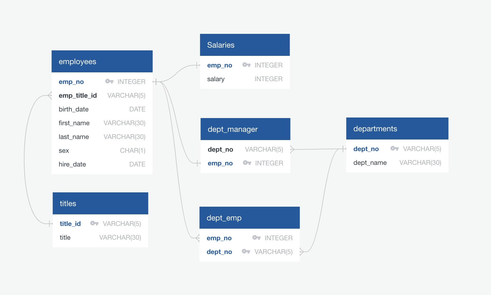

# sql_challenge
This project is divided into three parts:

##1- Data Modeling
In the data modeling, i inspected 6 CSV files then sketched an Entity Relationship Diagram of the tables.

##2- Data Engineering
I created table schemas for each of the six CSV files, specified primary keys, foreign keys, and other contraints for each table. Finally, i imported each CSV file into its corresponding SQL table.

##3- Data Analysis
In data analysis, the following was done:
 - A list of the employee number, last name, first name, sex, and salary of each employee.
 - A list of the first name, last name, and hire date for the employees who were hired in 1986.
 - A list of the manager of each department along with their department number, department name, employee number, last name, and first name.
 - A list of the department number for each employee along with that employee’s employee number, last name, first name, and department name.
 - A list of first name, last name, and sex of each employee whose first name is Hercules and whose last name begins with the letter B.
 - A list of each employee in the Sales department, including their employee number, last name, and first name.
 - A list of each employee in the Sales and Development departments, including their employee number, last name, first name, and department name.
 - A list of the frequency counts, in descending order, of all the employee last names (that is, how many employees share each last name).
